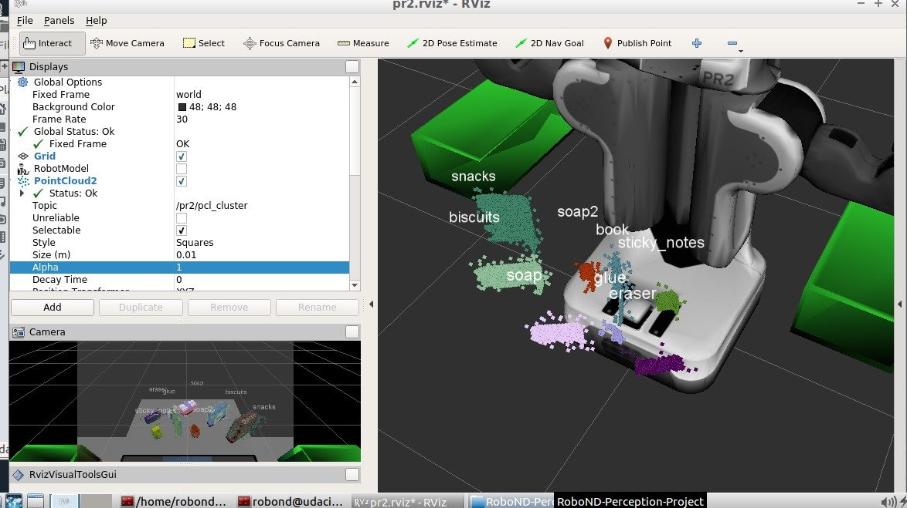
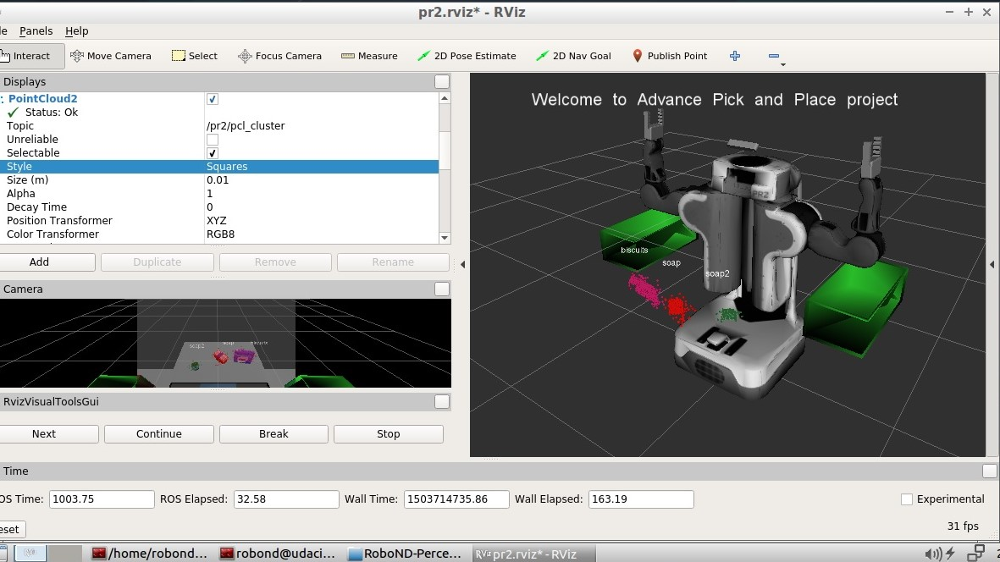
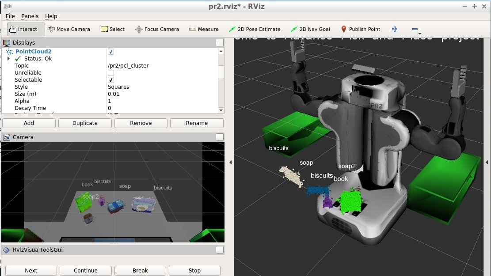

# RoboND Project: Perception Pick & Place

## Project Setup

#### 1. Generating training dataset. 
1. Go to download/clone the exercise repository.
```
  $ git clone https://github.com/roboticistYan/RoboND-Perception-Exercises
```
2. Move `sensor_sticker` into catkin workspace.

```
  $ cp sensor_sticker ~/catkin_ws/src
```
3. Activate training environment

```
  $ roslaunch sensor_stick training.launch
```

4. Generate training data

```
  $ cd ~/catkin_ws
  $ rosrun sensor_stick capture_features.py
```

#### 2. Object detection on RGBD images / point cloud data
1. Clone this repository into catkin workspace

```
  $ cd ~/catkin_ws/src
  $ git clone https://github.com/roboticistYan/RoboND-Perception-Project
```

2. Edit `pick_place_project.launch` and change the test setup by changing `test*.world` at line 13 and `pick_list_*.yaml` at line 39. Substitute `*` with case numbers 1~3.

```
  $ rosed pr2_robot pick_place_project.launch
```

3. Activate simulation environment. Note that the gazebo gui was disabled to save resources. So you will only see the Rviz interface.

```
  $ roslaunch pr2_robot pick_place_project.launch
```

4. Run perception script and assign corresponding test case number as argument. Below is an example of case 3.

```
  $ rosrun pr2_robot perception.py 3
```

If everything works out, you should be able to see successful object recognition like this.




## [Rubric](https://review.udacity.com/#!/rubrics/1067/view)

### Writeup / README

#### 1. Provide a Writeup / README that includes all the rubric points and how you addressed each one.  You can submit your writeup as markdown or pdf.  

You're reading it!

### Exercise 1, 2 and 3 pipeline implemented
#### 1. Complete Exercise 1 steps. Pipeline for filtering and RANSAC plane fitting implemented.

1. Statistical filtering remove outliers that has less than 200 neighbors.
2. Downsampled by 0.01 at x, y and z.
3. In addition to passthrough filtering on z axis, I also implement passthrough filtering on x axis in order to remove noises caused by the edge of boxes.
4. Used RANSAC to identify the table; And the remaining point clouds are objects that need to be clustered.

#### 2. Complete Exercise 2 steps: Pipeline including clustering for segmentation implemented.  

5. Used Euclidean clustering to separate different clusters. The cluster size was limited between 50 and 800 points.

After clustering, publish the point clouds ro RViz.

ROS topic | Description
--- | ---
/pr2/pcl_filtered | point clouds after removing outliers and downsampling
/pr2/pcl_tabel | table point cloud segmented by RANSAC
/pr2/pcl_objects | objects point cloud excluded from RANSAC
/pr2/pcl_clusters | clusters with different colors

#### 3. Complete Exercise 3 Steps.  Features extracted and SVM trained.  Object recognition implemented.

1. In order to generate a comprehensive dataset, I enumerated the objects in pick_list_3.yaml (package pr2_robot) at capture_features.py (package sensor_stick); and generate 80 measurements.
2. After having the dataset, I rosran traing_svm.py to generate a classification model. The model was reported to have accuracy of 97%.
3. Finally, I used this model to classify clustered point cloud following steps in excercise 2.


### Pick and Place Setup

#### 1. For all three tabletop setups (`test*.world`), perform object recognition, then read in respective pick list (`pick_list_*.yaml`). Next construct the messages that would comprise a valid `PickPlace` request output them to `.yaml` format.

The output yaml files are placed in the `output` directory. The following table shows the accuracy metrics.
Test  | Objects | Recognized | Accuracy
--- | --- | --- | ---
1 | 3 | 3 | 100%
2 | 5 | 4 | 80%
3 | 8 | 8 | 100%
 




### Discussion

Test 3 was harder because the objects are cramped on the table. Since the size of objects varies, I had to set clustering size limit to be [50, 600]. When the objects are close, they are sometimes combined as a single cluster.

In this project, I only used color histogram and surface normal histogram as featrues. If more featrues are taken into account, the classification could become more robust. For instance, my glue was classified as biscuit by mistake. In this case, size can be a useful feature to distinguish biscuit and glue.


